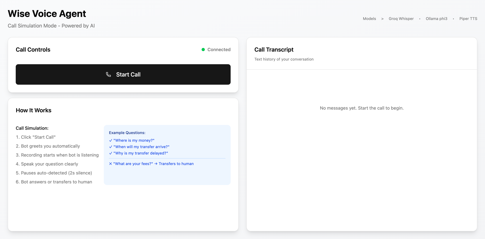

# Voice Agent Demo

AI-powered voice agent for customer support with real-time speech interaction.


*Add screenshot here: `voice-agent-demo.png`*

## Quick Start

### Backend
```bash
cd backend
chmod +x setup.sh
./setup.sh
# Add GROQ_API_KEY to .env
pnpm dev
```

### Frontend
```bash
cd frontend
pnpm install
pnpm dev
```

Visit http://localhost:5173

## Features

- Real-time voice conversation
- Voice activity detection (2s silence)
- Automatic call deflection
- Call transcript with audio playback

## Tech Stack

**Frontend:** React, TypeScript, Socket.io, Zustand
**Backend:** Node.js, Socket.io, Groq Whisper, Ollama phi3, Piper TTS

## Documentation

- [Backend README](./backend/README.md)
- [Frontend README](./frontend/README.md)