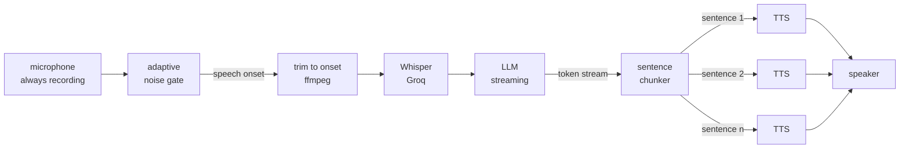
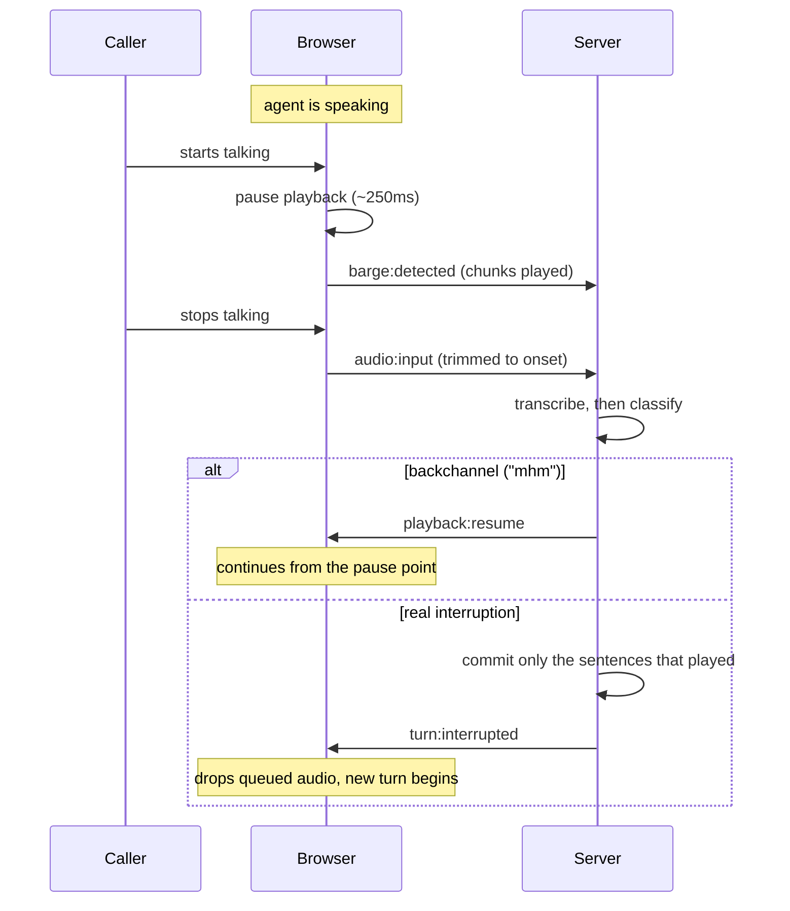

# Voice Agent

An interruptible, general-purpose voice agent. Speech in, speech out, over a
WebSocket.

The premise: **a voice conversation lives or dies on the infrastructure around
the model, not the model itself.** A weak model that lets you interrupt it,
knows what you actually heard, and can pick up a dropped thread feels better to
talk to than a strong one that talks over you. Everything here is built to hold
up with a small, cheap model behind it.

<!-- Drop a screen recording of a call here — an interruption mid-sentence is
     the thing worth showing.  -->

---

## What it does

**Streams by sentence.** Audio for sentence one is synthesised and playing while
the model is still writing sentence three. First audio lands in well under a
second instead of after the full response.

**Tells a backchannel from an interruption.** Saying "mhm" while the agent talks
doesn't stop it — playback pauses, the utterance is transcribed and classified,
and if it was only an acknowledgement playback resumes from exactly where it
stopped. A real question stops the agent immediately.

**Keeps history honest about what was heard.** When you do interrupt, the agent
has usually generated more than it managed to say. Only the sentences that
actually finished playing go into history, flagged as interrupted. The model
never refers back to something you never heard — and the unsaid remainder is
kept, so "go back to what you were explaining" produces a continuation rather
than a blank look.

**Recovers from its own mistakes.** Per-stage timeouts, a watchdog for a call
that stops making progress — with the client heartbeating while it plays, so a
long answer is never mistaken for a stall — an adaptive noise gate calibrated to
your microphone, and a filter for the caption boilerplate Whisper emits when
handed silence.

---

## How a turn works



The microphone records for the entire call rather than starting when speech is
detected — detection needs ~250ms of sustained sound to be confident, and by
then the first word is already spoken. Recording continuously means the onset is
always captured; the server trims back to it.

## How an interruption works



The agent goes quiet in about 250ms, because pausing doesn't wait for the
transcript. The *decision* costs longer, because classifying needs words and
words need you to stop talking — see the latency budget below.

---

## Running locally

### 1. Get a Groq API key (free, ~2 minutes)

1. Go to **https://console.groq.com**, sign in with Google or GitHub.
2. **API Keys** → **Create API Key**, copy the value — you only see it once.

No credit card. One key covers both speech-to-text and the LLM. The free tier
gives 8 hours/day of Whisper and 1,000 LLM requests/day.

### 2. Backend

```bash
cd backend
npm install
cp .env.example .env          # paste your key into GROQ_API_KEY
npm run dev
```

```bash
curl -s localhost:3000/health
```

`"groqKey": "configured"` means the key was picked up.

### 3. Frontend

```bash
cd frontend
npm install
npm run dev
```

Open http://localhost:5173, click **Start talking**, allow microphone access.
The browser only grants a mic on `localhost` or over HTTPS.

### 4. Try to break it

- Ask it something, then **talk over it** — it stops mid-sentence.
- Say **"mhm"** while it talks — it keeps going.
- Interrupt, change the subject, then ask it to **go back** — it continues the
  thread it was cut off from.

Open **debug** (top right) for live call state, microphone level against the
calibrated thresholds, per-stage latency, a reaction benchmark, and an
exportable diagnostic log.

---

## Latency budget

Interruption handling is a pipeline and the caller feels the sum of it. The
debug panel measures each stage live; these are the fixed costs.

| Stage | Cost | Notes |
|---|---|---|
| Detect the caller's voice | 250 ms | Sustained sound before we believe it's speech. Lower it and a cough stops the agent. |
| Pause playback | ~0 ms | Local. The agent goes quiet almost immediately. |
| Wait for the caller to finish | 450 ms over-speech / 900 ms normal turn | The largest controllable cost. |
| Prepare audio | 0–20 ms | Whisper takes webm directly, so nothing is transcoded; a trim is a stream-copy remux. |
| Transcribe | 300–500 ms | Groq Whisper. Network-bound. |
| Classify | <5 ms | A set lookup, deliberately not a model call. |

Over-speech deliberately uses a tighter endpointing window than a normal turn:
while the agent is paused every millisecond is dead air, and backchannels are
short by nature.

| Measure | Good | Acceptable | Broken |
|---|---|---|---|
| Agent goes quiet on interrupt | <300 ms | <500 ms | >800 ms |
| Resume after a backchannel | <800 ms | <1200 ms | >1500 ms |
| First audio of a reply | <900 ms | <1500 ms | >2500 ms |

If the decision time is consistently over ~1.2s, cut the endpointing window
first — not the model.

---

## Configuration

Every provider is pluggable, so the same code runs locally and deployed.

| Variable | Options | Default | Notes |
|---|---|---|---|
| `LLM_PROVIDER` | `groq`, `ollama` | `groq` | `ollama` is fully offline but needs Ollama running. |
| `GROQ_MODEL` | any free chat model | `openai/gpt-oss-20b` | Groq dropped Llama from the free tier in 2026. [Current list](https://console.groq.com/docs/models). |
| `TTS_PROVIDER` | `say`, `groq`, `piper` | `groq` | `.env.example` sets `say` for local dev — see below. |
| `GROQ_TTS_VOICE` | Orpheus voices | `troy` | Only when `TTS_PROVIDER=groq`. |
| `AGENT_PERSONA` | any prompt | general assistant | Repurpose the agent without touching code. |
| `AGENT_GREETING` | any text | "Hey, I'm listening…" | First thing it says. |

### Getting a Piper voice

Only needed for `TTS_PROVIDER=piper`, which is now opt-in: deployment uses
hosted synthesis because the free instance has 0.1 vCPU, where Piper took ~29s
for a single sentence. The ~63MB model is not committed — git keeps binaries in
history forever and it belongs to its publisher — so fetch it when you want it:

```bash
cd backend && npm run fetch-voice
```

### Why `say` locally and Piper in deployment

The `piper-tts` macOS arm64 wheel (1.8.0) ships an espeak-ng data path pointing
at its own CI build machine, so it cannot synthesise anything on a Mac — the
native bridge ignores the data directory it is given. The Linux wheel used in
the container is unaffected. Local development therefore uses macOS's built-in
`say` (no setup, no 60 MB model download) and deployment uses Piper. It is one
environment variable; the call site is identical.

---

## Tests

```bash
cd backend && npm test
```

Covers the logic where a bug is invisible in a demo but wrong in conversation:
history truncation after an interruption, salvaging an abandoned turn,
backchannel classification, and the Whisper silence-artefact filter.

## Deployment

$0/month on Render + Vercel + Groq. The repo carries the config —
[`render.yaml`](./render.yaml), [`backend/Dockerfile`](./backend/Dockerfile) and
[`frontend/vercel.json`](./frontend/vercel.json) — so deploying is mostly
clicking.

See [DEPLOYMENT.md](./DEPLOYMENT.md) for the steps, the free-tier cold-start
trap, and how to stop one visitor exhausting the daily quota.

---

## Layout

```
backend/src/
  server.ts                    socket protocol, call state, interruption triage
  services/conversation.ts     history; truncation to what was actually heard
  services/backchannel.ts      "mhm" vs a real interruption; silence artefacts
  services/sentenceChunker.ts  token stream → speakable sentences
  services/llmService.ts       streaming LLM, provider-agnostic, cancellable
  services/ttsService.ts       TTS, provider-agnostic, cancellable
  services/whisperService.ts   Groq Whisper STT
  services/audioProcessor.ts   trims to the speech onset; never transcodes
  services/timeline.ts         per-stage turn timings
  smoke.ts                     tests

frontend/src/
  components/VoiceAgent/Orb.tsx         state-coloured, level-reactive orb
  components/VoiceAgent/DebugPanel.tsx  state, mic meter, latency, event log
  hooks/useMicStream.ts                 one mic stream per call
  hooks/useVoiceActivityDetection.ts    adaptive noise gate, speech edges
  hooks/useAudioPlayback.ts             queue with pause/resume/stop
  hooks/useAudioRecorder.ts             continuous capture
  hooks/useSocketConnection.ts          streaming protocol
  lib/diagnostics.ts                    exportable session log
```

## Design notes

**Classification is a set lookup, not a model call.** It sits on the critical
path between the caller speaking and the agent reacting, so it has to be
instant and predictable. A model call here would add hundreds of milliseconds
to the one measurement that matters most.

**Thresholds are measured, not hardcoded.** Microphone gain varies by an order
of magnitude across machines; a level that is obviously speech on one laptop is
below the noise floor on another. The noise floor is estimated as a low
percentile of recent frames — percentiles survive someone talking through the
calibration in a way a mean does not.

**The state machine has a watchdog.** Rapid interruptions can abandon a turn
with no successor. Rather than enumerate every such race, any busy state that
stops making progress is recovered.

**Whisper does not return nothing for silence.** It returns caption boilerplate
— "Thank you.", "Thanks for watching!" — because it was trained on subtitled
video. Recognising the artefact is far cheaper than trying to stop the model
producing it.

## Known limitations

- Single instance, no horizontal scaling. Fine for a demo, not for production.
- Conversation state lives in memory per socket and dies with it.
- Interruption decisions need the full utterance, so the floor on reaction time
  is the endpointing window plus transcription. Speculative resume — playing
  again on silence and retracting if the transcript turns out to be a question
  — would cut it further.
- Requirements: Node 20+, `ffmpeg` on PATH, macOS for `TTS_PROVIDER=say`.

## Licence

MIT — see [LICENSE](./LICENSE).
